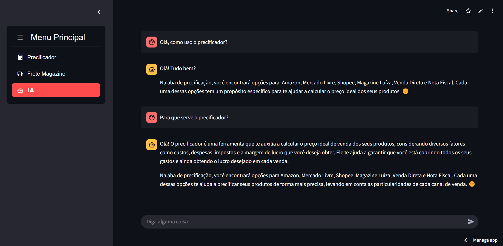
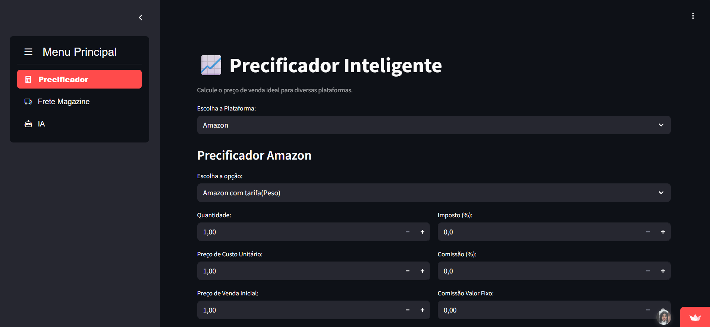
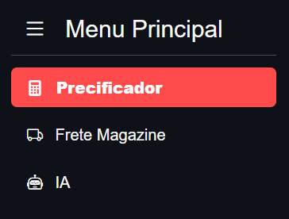
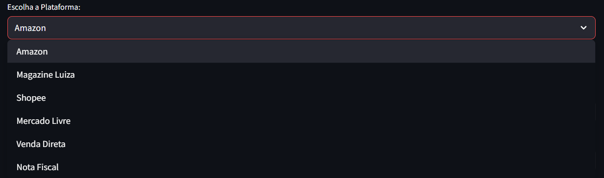
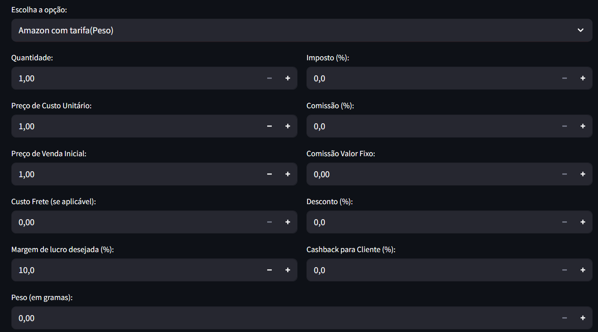
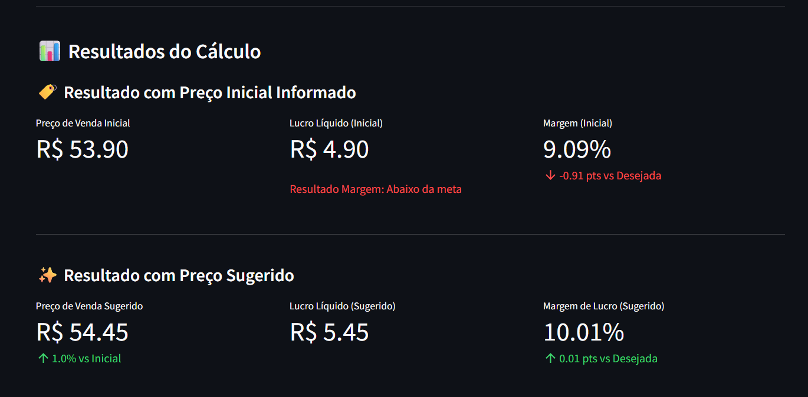
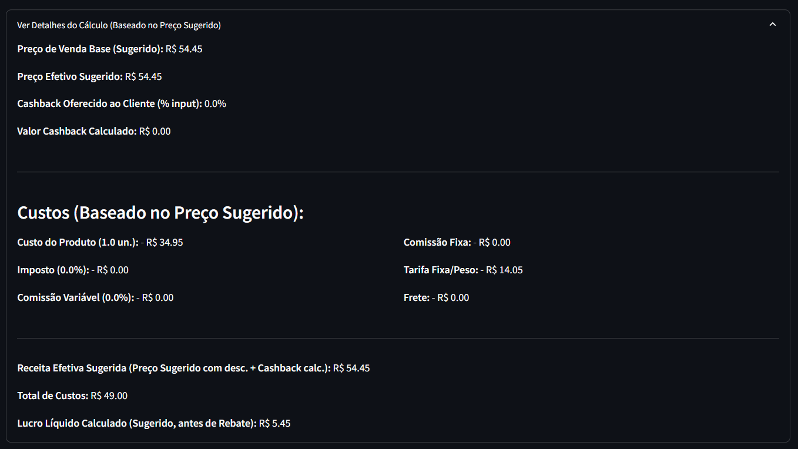
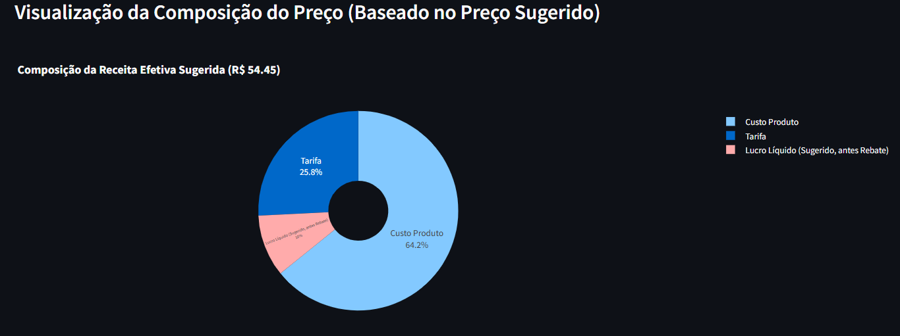

# Documentação do Precificador Inteligente 

[Aplicativo](innovamed.streamlit.app)

# Novidade 

## 1. IA (Assistente)

Esta seção fornece uma interface de chat para interagir com um assistente de Inteligência Artificial (AIGoogle).

**Como Usar:**
1.  Digite sua pergunta ou comando no campo de texto na parte inferior da tela ("Diga alguma coisa").
2.  Pressione Enter ou clique no ícone de enviar.
3.  A pergunta do usuário e a resposta da IA serão exibidas no histórico do chat.

O objetivo desta IA é fornecer assistência relacionada ao uso do precificador e informações contextuais. Lembre-se de que a IA foi pré-programada com um conjunto de informações (conforme documento fornecido anteriormente ao desenvolvedor) e tentará responder com base nesse conhecimento.

Este documento descreve as funcionalidades e o uso do aplicativo Precificador Inteligente, desenvolvido para auxiliar no cálculo de preços de venda em diversas plataformas de e-commerce, estimativa de fretes e interação com uma IA assistente.

## 2. Menu Principal

Ao acessar o aplicativo, você encontrará um menu na barra lateral esquerda com as seguintes opções principais:

*   **Precificador**: Para calcular preços de venda e margens de lucro.
*   **Frete Magazine**: Para calcular o custo de frete estimado para produtos na Magazine Luiza.
*   **IA**: Para interagir com um assistente virtual baseado em Inteligência Artificial.

## 3. Precificador

Esta é a seção principal para calcular preços de venda, custos e margens.

Primeiro, escolha a plataforma para a qual deseja calcular o preço no seletor "Escolha a Plataforma:":

*   Amazon
*   Magazine Luiza
*   Shopee
*   Mercado Livre
*   Venda Direta
*   Nota Fiscal

### 3.1. Amazon

Permite calcular o preço de venda para produtos na Amazon, considerando diferentes tipos de tarifa.

**Opções Específicas da Amazon:**
*   **Escolha a opção:**
    *   `Amazon com tarifa(Peso)`: Inclui uma tarifa adicional baseada no peso do produto.
    *   `Amazon sem tarifa(Peso)`: Não inclui a tarifa baseada no peso.

**Campos de Entrada:**
*   **Quantidade:** Número de unidades do produto.
*   **Preço de Custo Unitário:** Custo de aquisição de uma unidade do produto.
*   **Preço de Venda Inicial:** Preço pelo qual você pretende vender inicialmente.
*   **Custo Frete (se aplicável):** Valor do frete que será arcado pelo vendedor.
*   **Margem de lucro desejada (%):** Percentual de lucro que você deseja obter.
*   **Imposto (%):** Percentual de imposto sobre a venda.
*   **Comissão (%):** Percentual de comissão da Amazon sobre a venda.
*   **Comissão Valor Fixo:** Valor fixo de comissão, se houver.
*   **Desconto (%):** Percentual de desconto oferecido ao cliente sobre o preço de venda.
*   **Cashback para Cliente (%):** Percentual de cashback oferecido ao cliente (calculado sobre o preço de venda original se houver desconto).
*   **Peso (em gramas):** (Aparece apenas se "Amazon com tarifa(Peso)" for selecionado) Peso do produto em gramas para cálculo da tarifa.
    *   A tarifa é calculada automaticamente com base no peso inserido.

**Botão:**
*   `Calcular Preço Amazon`: Inicia o cálculo.

**Resultados Apresentados (`display_detailed_results`):**
Após o cálculo, são exibidos:
4.  **Resultado com Preço Inicial Informado:**
    *   Preço de Venda Inicial (e com desconto, se aplicável).
    *   Lucro Líquido (Inicial).
    *   Margem (Inicial) e comparação com a meta.
5.  **Resultado com Preço Sugerido:**
    *   Preço de Venda Sugerido (para atingir a margem desejada).
    *   Lucro Líquido (Sugerido).
    *   Margem de Lucro (Sugerido) e comparação com a meta.
    *   Se houver "Rebate Fixo" (não aplicável na Amazon atualmente, mas a lógica existe), o lucro com rebate é mostrado.
6.  **Detalhes do Cálculo (Baseado no Preço Sugerido) - Expansível:**
    *   Preço de Venda Base (Sugerido).
    *   Desconto Aplicado (se houver) e Preço Efetivo Sugerido.
    *   Cashback Oferecido e Calculado.
    *   **Custos:** Custo do Produto, Imposto, Comissão Variável, Comissão Fixa, Tarifa Fixa/Peso, Frete.
    *   Receita Efetiva Sugerida, Total de Custos, Lucro Líquido Calculado.
7.  **Visualização da Composição do Preço (Baseado no Preço Sugerido):**
    *   Um gráfico de pizza mostrando a distribuição dos custos e lucro no preço de venda sugerido.

### 3.2. Magazine Luiza

Calcula o preço para a Magazine Luiza, com opções de comissão e tarifa fixa.

**Opções Específicas da Magazine Luiza:**
*   **Escolha a opção de comissão:**
    *   `Magazine 12,80%`
    *   `Magazine 18%`
    *   *Nota: Uma tarifa fixa de R$ 5,00 é aplicada automaticamente se o preço de venda for >= R$ 10,00.*

**Campos de Entrada:**
*   **Quantidade, Preço de Custo Unitário, Preço de Venda Inicial, Custo Frete, Margem de lucro desejada (%)**
*   **Imposto (%), Desconto (%), Cashback para Cliente (%)**
*   **Rebate Fixo (Valor R$):** Um valor fixo de rebate que pode ser considerado no lucro.

**Botão:**
*   `Calcular Preço Magazine`

**Resultados Apresentados:**
*   Segue a mesma estrutura do `display_detailed_results` descrito na seção Amazon, adaptado para as taxas da Magazine Luiza (comissão e tarifa fixa de R$5). O "Rebate Fixo" é somado ao lucro líquido para cálculo da margem, se informado.
### 3.3. Shopee

Calcula o preço para a Shopee, com comissão e tarifa fixa pré-definidas.

**Taxas Shopee (Pré-definidas no código):**
*   Comissão: 20%
*   Tarifa Fixa: R$ 4,00

**Campos de Entrada:**
*   **Quantidade, Preço de Custo Unitário, Preço de Venda Inicial, Custo Frete, Margem de lucro desejada (%)**
*   **Imposto (%), Desconto (%)**
    *   *Nota: Cashback e Rebate não são campos de entrada diretos para Shopee nesta interface.*

**Botão:**
*   `Calcular Preço Shopee`

**Resultados Apresentados:**
*   Segue a mesma estrutura do `display_detailed_results` descrito na seção Amazon, utilizando as taxas fixas da Shopee.
### 3.4. Mercado Livre

Calcula o preço para o Mercado Livre, com diferentes tipos de anúncio e estruturas de tarifa.

**Opções Específicas do Mercado Livre:**
*   **Escolha o tipo de anúncio e tarifa:** (Combinações de Clássico/Premium com Tarifa Padrão/Super Mercado)
    *   `Clássico / Tarifa Padrão (12% + Tarifa Fixa Padrão (<R$79))`
    *   `Clássico / Super Mercado (14% + Fixa R$ 2.00)`
    *   `Premium / Tarifa Padrão (17% + Tarifa Fixa Padrão (<R$79))`
    *   `Premium / Super Mercado (19% + Fixa R$ 2.00)`
    *   *Nota: A Tarifa Fixa Padrão é R$ 6,25 se preço < R$29, R$ 6,50 se R$29 <= preço < R$50, e R$ 6,75 se R$50 <= preço < R$79. Para preços >= R$79, a tarifa fixa padrão é R$0, mas o frete (muitas vezes grátis e arcado pelo vendedor) deve ser considerado.*

**Campos de Entrada:**
*   **Quantidade, Preço de Custo Unitário, Preço de Venda Inicial, Custo Frete (Repassado ou Grátis), Margem de lucro desejada (%)**
*   **Imposto (%), Desconto (%)**
*   **Rebate (Valor Fixo):** Um valor fixo de rebate.

**Botão:**
*   `Calcular Preço Mercado Livre`

**Resultados Apresentados:**
*   Segue a mesma estrutura do `display_detailed_results`, adaptado para as taxas do Mercado Livre, incluindo o cálculo dinâmico da tarifa fixa padrão. O "Rebate" é somado ao lucro líquido para cálculo da margem.
### 3.5. Venda Direta

Calcula o preço para vendas diretas, sem comissões ou tarifas de marketplace.

**Campos de Entrada:**
*   **Quantidade, Preço de Custo Unitário, Preço de Venda Inicial, Custo Frete, Margem de lucro desejada (%)**
*   **Imposto (%)**
    *   *Nota: Desconto, Cashback e Rebate não são campos de entrada diretos para Venda Direta nesta interface.*

**Botão:**
*   `Calcular Preço Venda Direta`

**Resultados Apresentados:**
*   Segue a mesma estrutura do `display_detailed_results`, simplificado para não incluir comissões ou tarifas de marketplace.
### 3.6. Nota Fiscal

Calcula o custo final de um produto com base nos dados de uma nota fiscal, considerando IPI e bonificações.

**Campos de Entrada:**
*   **Quantidade Comprada:** Número de unidades adquiridas na NF.
*   **Preço de Custo Unitário (NF):** Custo unitário do produto conforme a NF.
*   **IPI (%):** Percentual de IPI sobre o valor dos produtos.
*   **Bonificação (Valor Total R$):** Valor total de bonificação em R$.
*   **Bonificação (% sobre Valor Total Produtos):** Percentual de bonificação sobre o valor total dos produtos na NF.
    *   *Nota: Informe a bonificação OU em valor OU em porcentagem. Se ambos forem informados, o valor em R$ terá prioridade.*

**Botão:**
*   `Calcular Custo NF`

**Resultados Apresentados:**
*   **Valor Total Produtos (NF)**
*   **Valor IPI Calculado**
*   **Valor da Bonificação Aplicada** (se houver)
*   **Valor Total Final Calculado (NF)**
*   **Custo Unitário Final Efetivo**
*   Um **detalhamento** em formato de tabela mostrando os componentes do cálculo.

## 4. Frete Magazine

Esta seção permite estimar o custo de frete para produtos na Magazine Luiza com base na sua reputação de vendedor e nas dimensões/preço dos produtos.

**Passos para Utilização:**

8.  **Selecione sua Reputação no Magalu (na barra lateral):**
    *   `< 92% (sem desconto)`
    *   `Entre 92% e 97% (desconto 25%)`
    *   `>= 97% (desconto 50%)`
    *   `Líder/Outros (desconto 75%)`
    A seleção da reputação é crucial para aplicar o desconto correto no frete.

9.  **Importe a(s) planilha(s) de produtos do Magalu (.xlsx):**
    *   Clique no botão de upload e selecione os arquivos Excel.
    *   Os arquivos devem conter as abas `PRODUTO` e `PREÇO`.
    *   Colunas necessárias na aba `PRODUTO`: `SKU`, `TITULO`, `COMPRIMENTO`, `LARGURA`, `ALTURA`, `Status do Produto`.
    *   Colunas necessárias na aba `PREÇO`: `SKU`, `Preço POR`.
    *   O sistema processará apenas produtos com "Status do Produto" igual a "publicado".

**Cálculo do Frete (`calcular_custo_frete`):**
*   O peso volumétrico é calculado: `(comprimento * largura * altura em metros) * 167`.
*   Se o `Preço POR` do produto for <= R$ 79,00, o custo base do frete é R$ 0.
*   Caso contrário, o custo base é determinado por faixas de peso (ex: <= 0.5kg: R$ 27,90; 0.5kg < peso <= 1kg: R$ 32,90, etc.).
*   O desconto da reputação é aplicado sobre este custo base.

**Resultados:**
*   Uma tabela é exibida com as colunas `SKU`, `TITULO`, `Preço POR`, `COMPRIMENTO`, `LARGURA`, `ALTURA` e o `Custo Frete Estimado`.
*   Um botão `Baixar Planilha de Fretes Estimados` permite o download dos resultados em formato Excel.

---